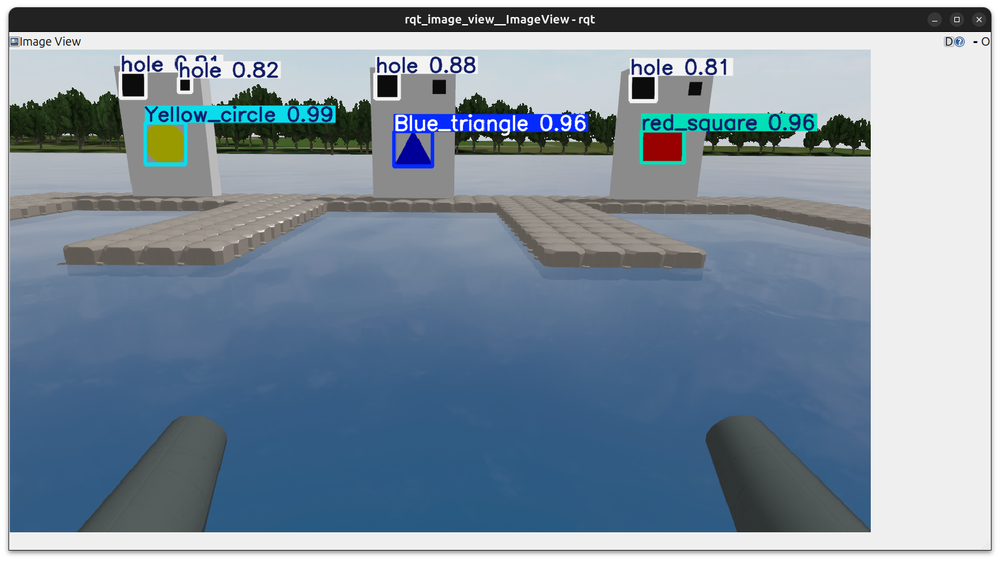

# Autonomous YOLO-Guided Aiming System for VRX
This repository contains a ROS 2 Jazzy implementation of an autonomous ball-shooter aiming system for the **WAM-V** in the **VRX (Virtual RobotX)** simulation.

## 🚀 Getting Started
To run this project, you must first have the official VRX environment installed.

### 1. Prerequisites
* **ROS 2 Jazzy** (Ubuntu 24.04)
* **Official VRX Repository**: [OpenRobotics VRX](https://github.com/osrf/vrx)
* **Python Libraries**:
  ```bash
  pip install ultralytics "numpy<2" "opencv-python<4.9" --break-system-packages

### 2.Execution Steps
Follow these steps in separate terminals to launch the autonomous mission:
#### Step 1: Launch the VRX Simulation
      ros2 launch vrx_gz competition.launch.py world:=scan_dock_deliver_task.sdf

#### Step 2: Start the YOLO Aiming Node
      python3 ~/vrx_ws/yolo_aiming_node.py


#### Step 3: Monitor the Vision Feed
    ros2 run rqt_image_view rqt_image_view
(Select the /yolo/detections_image topic to see bounding boxes)

#### Step 4: Execute Approach Maneuver
    python3 ~/vrx_ws/simple_drive.py

## 📊 Results
The system utilizes YOLOv11 to detect dock targets (Yellow Circle, Blue Triangle) and maps pixel errors to gimbal joint commands for high-precision shooting.


